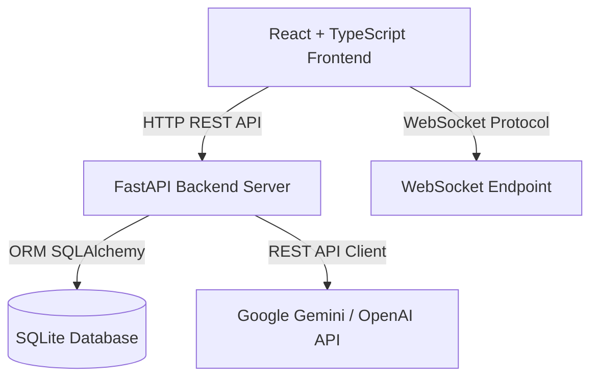
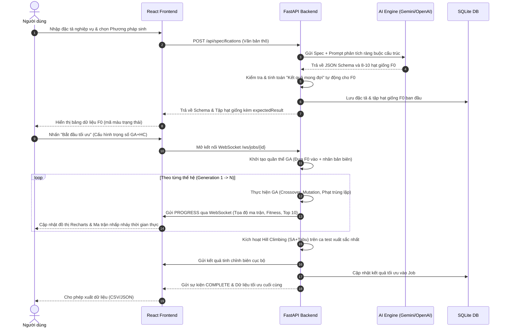
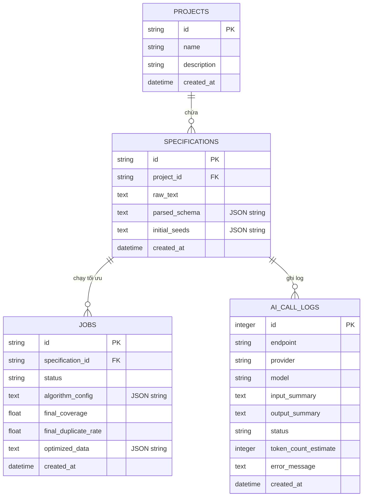

# CHƯƠNG 3. CÀI ĐẶT VÀ THỰC NGHIỆM

## 3.1. Phát biểu bài toán

### 3.1.1. Mô tả bài toán
Trong kỹ nghệ phần mềm, việc chuẩn bị dữ liệu kiểm thử biểu mẫu (Form/API Test Data) đóng vai trò quyết định hiệu quả của kiểm thử tự động (Automation Testing). Bài toán đặt ra là cần sinh ra một tập hợp dữ liệu kiểm thử $S = \{X_1, X_2, \dots, X_m\}$ nhằm kiểm tra một thực thể đầu vào gồm $n$ trường dữ liệu:
$$F = \{f_1, f_2, \dots, f_n\}$$

Mỗi trường dữ liệu $f_i$ có một miền giá trị xác định bởi kiểu dữ liệu $T_i$ và tập hợp các ràng buộc nghiệp vụ $C_i$:
- **Kiểu dữ liệu $T_i$**: Có thể thuộc các nhóm nguyên thủy như `string`, `number` hoặc các kiểu định dạng đặc thù như `email`, `card` (số thẻ tín dụng), `phone` (số điện thoại di động).
- **Ràng buộc $C_i$**: Bao gồm tính bắt buộc (`required`), khoảng giới hạn số học ($[minValue_i, maxValue_i]$), giới hạn độ dài ký tự ($[minLength_i, maxLength_i]$), danh sách các giá trị cho phép (Allowed Values / Enum), và biểu thức chính quy chính tả (`regex`).

Mỗi ca kiểm thử (Test Case) đại diện cho một nhiễm sắc thể (Chromosome) $X_j$, được biểu diễn dưới dạng một vector gán giá trị cho các trường tương ứng:
$$X_j = \{x_{j,1}, x_{j,2}, \dots, x_{j,n}\}$$
trong đó $x_{j,i}$ là giá trị thử nghiệm gán cho trường $f_i$.

### 3.1.2. Mục tiêu tối ưu hóa đa mục tiêu
Mục tiêu là tìm kiếm một tập hợp tối ưu $S$ chứa các ca kiểm thử nhằm giải quyết bài toán tối ưu hóa đa mục tiêu (Multi-objective Optimization):
1. **Tối đa hóa độ bao phủ định dạng nghiệp vụ (Validation Coverage - $COV_{val}$)**: Đảm bảo kiểm thử cả trường hợp dữ liệu hợp lệ (Positive) và không hợp lệ (Negative) của mọi ràng buộc.
2. **Tối đa hóa độ bao phủ cận biên (Boundary Coverage - $COV_{bound}$)**: Kích hoạt kiểm thử tại các giá trị biên của miền xác định ($B, B \pm 1$) nhằm phát hiện lỗi "off-by-one".
3. **Tối đa hóa độ bao phủ an toàn thông tin (Security Coverage - $COV_{sec}$)**: Nhúng các chuỗi tấn công SQL Injection và Cross-Site Scripting (XSS) để xác minh cơ chế lọc đầu vào.
4. **Tối đa hóa tính đa dạng (Diversity - $DIV$)**: Hạn chế tối thiểu sự tương đồng giữa các ca kiểm thử trong tập $S$.
5. **Tối thiểu hóa tỷ lệ trùng lặp (Duplicate Rate - $DUP$)**: Tránh dư thừa dữ liệu làm chậm quá trình kiểm thử tự động.

---

## 3.2. Phân tích và thiết kế hệ thống

### 3.2.1. Kiến trúc tổng thể
Hệ thống được thiết kế theo mô hình decoupled (tách biệt hoàn toàn) giữa Frontend và Backend để đảm bảo tính độc lập và khả năng mở rộng. 



- **React + Vite Frontend (Client)**: Cung cấp giao diện tương tác cao cấp (Glassmorphism), biểu diễn trực quan quá trình tiến hóa theo thời gian thực và quản lý lịch sử.
- **FastAPI Backend Server (Server)**: Đóng vai trò API Gateway, xử lý logic nghiệp vụ nghiệp vụ, điều phối công việc và thực hiện các thuật toán tối ưu hóa di truyền tính toán nặng.
- **SQLite Database**: Cơ sở dữ liệu cục bộ dùng để lưu trữ thông tin dự án, cấu trúc trường ràng buộc, lịch sử chạy thuật toán và nhật ký gọi AI.
- **AI Service (Gemini/OpenAI)**: Dịch vụ trí tuệ nhân tạo bên ngoài để phân tích ngữ nghĩa đặc tả và sinh tập mầm F0 ban đầu.

---

### 3.2.2. Quy trình hoạt động của hệ thống



---

### 3.2.3. Thiết kế dữ liệu và API

#### 1. Thiết kế Cơ sở dữ liệu (SQLite Schema ERD)
Hệ thống sử dụng hệ quản trị cơ sở dữ liệu SQLite gọn nhẹ thông qua SQLAlchemy ORM. Dưới đây là sơ đồ quan hệ thực thể (ERD):



#### 2. Thiết kế chi tiết REST API
- **Endpoint 1: Phân tích đặc tả yêu cầu nghiệp vụ**
  - **URL**: `POST /api/specifications`
  - **Request Body**:
    ```json
    {
      "raw_text": "Mô tả nghiệp vụ bằng ngôn ngữ tự nhiên...",
      "force_reanalyze": false,
      "api_key_override": "AIzaSy..."
    }
    ```
  - **Response Body (200 OK)**:
    ```json
    {
      "specification_id": "8307e467-1a8f-4765-8413-ad3c1ace3728",
      "project_id": "project_uuid",
      "fields": [
        {
          "name": "username",
          "type": "string",
          "required": true,
          "minLength": 5,
          "maxLength": 15,
          "description": "Tên đăng nhập"
        }
      ],
      "initialPopulation": [
        {
          "username": "admin123",
          "expectedResult": "Hợp lệ"
        }
      ],
      "cached": false
    }
    ```

- **Endpoint 2: Tái sinh tập hạt giống F0**
  - **URL**: `POST /api/generate-seeds`
  - **Request Body**:
    ```json
    {
      "fields": [{"name": "username", "type": "string", "required": true, "minLength": 5, "maxLength": 15}],
      "test_method": "bva",
      "boundary_count": 4,
      "partition_count": 3,
      "api_key_override": "",
      "raw_text": ""
    }
    ```

- **Endpoint 3: Kết nối WebSocket tiến hóa**
  - **URL**: `WS /ws/jobs/{specification_id}`
  - **Luồng bản tin gửi lên**:
    ```json
    {
      "generations": 60,
      "popSize": 100,
      "crossoverRate": 0.8,
      "mutationRate": 0.15,
      "weights": {
        "validation": 0.5,
        "boundary": 0.2,
        "security": 0.2,
        "diversity": 0.1
      },
      "initial_seeds": [{"username": "admin123", "expectedResult": "Hợp lệ"}]
    }
    ```
  - **Bản tin phản hồi định kỳ (`GA_PROGRESS`)**:
    ```json
    {
      "event": "GA_PROGRESS",
      "data": {
        "generation": 10,
        "bestFitness": 0.85,
        "avgFitness": 0.52,
        "coverage": 0.65,
        "duplicateRate": 0.05,
        "test_cases": [
          {"values": {"username": "admin123"}, "fitness": 0.85, "origin": "Seed"}
        ]
      }
    }
    ```

---

## 3.3. Xây dựng hệ thống

### 3.3.1. Module phân tích yêu cầu (AI Parser)
Module sử dụng khả năng hiểu ngữ nghĩa của các mô hình LLM lớn để chuyển đổi văn bản mô tả nghiệp vụ thành cấu trúc JSON Schema có cấu trúc chặt chẽ. Hệ thống sử dụng chế độ **JSON Response MimeType** để cưỡng chế định dạng trả về từ LLM.

#### Prompts hệ thống được xây dựng chi tiết như sau:
```text
You are an expert senior software developer and automated QA engineer.
Your task is to analyze the natural language specification of a web application input form 
and extract a structured JSON schema of the field constraints, plus a list of 8-10 smart initial 
test case records (F0 dataset) for a test suite.

The returned JSON must EXACTLY follow this structure:
{
  "fields": [
    {
      "name": "tên_trường_viết_thường_không_dấu",
      "type": "string" | "number" | "email" | "card" | "phone",
      "required": true | false,
      "minLength": 5, 
      "maxLength": 20, 
      "minValue": 18, 
      "maxValue": 100, 
      "regex": "pattern", 
      "allowedValues": ["VAL1", "VAL2"], 
      "description": "Giải thích ngắn gọn quy định của trường dữ liệu bằng Tiếng Việt"
    }
  ],
  "initialPopulation": [
    {
      "tên_trường_1": "giá_trị_test_1",
      "expectedResult": "Kết quả mong đợi tương ứng bằng Tiếng Việt"
    }
  ]
}
```

---

### 3.3.2. Module sinh test case bằng LLM
Nhằm hỗ trợ quá trình tối ưu hóa, module sinh mẫu F0 sử dụng các phương pháp luận kiểm thử kinh điển làm chỉ dẫn trong prompt:
- **Boundary Value Analysis (BVA)**: Chỉ định sinh tập trung vào 4 điểm biên (ví dụ: với biên $B$, sinh $B-1, B, B+1$).
- **Equivalence Partitioning (EP)**: Phân chia miền giá trị thành các khoảng tương đương và chỉ định lấy giá trị trung bình đại diện cho mỗi vùng.
- **Decision Table**: Tạo lập các kết hợp kiểm thử logic (kiểm tra trường hợp tất cả hợp lệ, kiểm tra lần lượt từng trường không hợp lệ trong khi các trường khác hợp lệ, các kịch bản tiêm nhiễm mã độc).

---

### 3.3.3. Module đánh giá test case (Toán học hóa các điểm thành phần)
Hàm thích nghi (Fitness) đa mục tiêu của một cá thể nhiễm sắc thể $X$ được lượng hóa chi tiết theo các công thức thành phần:

#### 1. Điểm định dạng nghiệp vụ (Validation Score)
Xét nhiễm sắc thể $X$ biểu diễn một test case. Điểm Validation Score được tính bằng trung bình cộng điểm hợp lệ của từng trường dữ liệu:
$$ValidationScore(X) = \frac{1}{n} \sum_{i=1}^{n} v_i(x_i)$$

Trong đó, điểm thành phần $v_i(x_i)$ của trường $f_i$ được đánh giá:
- Nếu $f_i$ có thuộc tính `required` là `true` nhưng giá trị $x_i$ rỗng hoặc khuyết: $v_i(x_i) = 0$.
- Nếu $f_i$ thuộc kiểu dữ liệu đặc thù (`email`, `phone`, `card`) và không khớp với biểu thức chính quy định dạng: $v_i(x_i) = 0$.
- Nếu $f_i$ thuộc kiểu `number`, nằm ngoài cận $[minValue_i, maxValue_i]$:
  - Nếu là ca kiểm thử được dán nhãn cố tình thử sai (Negative case): $v_i(x_i) = 1.0$.
  - Nếu là ca kiểm thử chuẩn (Positive case): $v_i(x_i) = 0.0$.
- Các trường hợp khớp hoàn toàn định dạng: $v_i(x_i) = 1.0$.

#### 2. Điểm bao phủ giá trị biên (Boundary Score)
Được thiết kế để thưởng cho các ca kiểm thử chạm cận biên nghiệp vụ để phát hiện lỗi lập trình "lệch 1 đơn vị":
$$BoundaryScore(X) = \frac{1}{n} \sum_{i=1}^{n} b_i(x_i)$$

Đối với mỗi trường $f_i$:
- Nếu $f_i$ là kiểu `number` có giới hạn $[minValue_i, maxValue_i]$:
  - Nếu $x_i = minValue_i$ hoặc $x_i = maxValue_i$: $b_i(x_i) = 1.0$.
  - Nếu $x_i = minValue_i + 1$ hoặc $x_i = maxValue_i - 1$: $b_i(x_i) = 0.8$.
  - Nếu $x_i = minValue_i - 1$ hoặc $x_i = maxValue_i + 1$: $b_i(x_i) = 0.9$ (biên ngoài không hợp lệ).
- Nếu $f_i$ là kiểu `string` có giới hạn độ dài $[minLength_i, maxLength_i]$:
  - Nếu $len(x_i) = minLength_i$ hoặc $len(x_i) = maxLength_i$: $b_i(x_i) = 1.0$.
  - Nếu $len(x_i) = minLength_i \pm 1$ hoặc $len(x_i) = maxLength_i \pm 1$: $b_i(x_i) = 0.8$.

#### 3. Điểm an toàn thông tin (Security Score)
Nhằm kiểm tra khả năng phòng chống tấn công chèn mã độc của ứng dụng:
$$SecurityScore(X) = \frac{1}{n} \sum_{i=1}^{n} s_i(x_i)$$

Trong đó:
- $s_i(x_i) = 1.0$ nếu trường $f_i$ chứa các mẫu tiêm nhiễm SQL Injection như `' OR 1=1 --`, `' UNION SELECT`, hoặc thẻ tấn công XSS như `<script>`, `<svg/onload=...`.
- $s_i(x_i) = 0.0$ cho các trường hợp bình thường.

#### 4. Điểm đa dạng quần thể (Diversity Score)
Tránh việc quần thể bị hội tụ sớm vào một vài giá trị tối ưu duy nhất bằng cách đo lường khoảng cách khoảng các chuỗi văn bản của cá thể $X$ với toàn bộ quần thể hiện tại $P$:
$$DiversityScore(X) = \frac{1}{|P|-1} \sum_{Y \in P, Y \neq X} H(X, Y)$$
trong đó $H(X, Y)$ là khoảng cách Hamming chuẩn hóa đo tỷ lệ các trường có giá trị khác nhau giữa $X$ và $Y$.

---

### 3.3.4. Module tối ưu bằng Memetic Algorithm

#### 1. Giải thuật di truyền (GA) nâng cấp
GA thực hiện tìm kiếm tối ưu trên không gian toàn cục. Mã giả quy trình tiến hóa qua mỗi thế hệ được thiết lập:

```text
Algorithm: Evolve_One_Generation(Population P, Config C)
Input: Quần thể thế hệ cũ P, cấu hình di truyền C
Output: Quần thể thế hệ mới P_next

1. Sắp xếp P theo Fitness giảm dần.
2. P_next <- Khởi tạo mảng rỗng.
3. // 1. Cơ chế tinh hoa (Elitism - Giữ lại 5% cá thể tốt nhất)
4. elite_size <- max(1, int(C.popSize * 0.05))
5. for i = 0 to elite_size - 1 do:
6.    P_next.append(P[i])
7.
8. // 2. Vòng lặp sinh sản qua Crossover và Mutation
9. while len(P_next) < C.popSize do:
10.   parent1 <- Tournament_Selection(P, size=3)
11.   parent2 <- Tournament_Selection(P, size=3)
12.   
13.   child1, child2 <- Single_Point_Crossover(parent1, parent2, rate=C.crossoverRate)
14.   child1 <- Adaptive_Mutation(child1, rate=C.mutationRate)
15.   child2 <- Adaptive_Mutation(child2, rate=C.mutationRate)
16.   
17.   P_next.append(child1)
18.   if len(P_next) < C.popSize do:
19.       P_next.append(child2)
20.
21. // 3. Đánh giá lại toàn bộ quần thể mới
22. Evaluate_Population(P_next)
23. return P_next
```

- **Tournament Selection với Crowding Distance**: Lựa chọn 3 cá thể ngẫu nhiên. Nếu 2 cá thể có điểm thích nghi chênh lệch nhỏ hơn $0.05$, cá thể có khoảng cách lân cận (Crowding Distance) lớn hơn (nằm ở vùng thưa thớt hơn trong không gian tìm kiếm) sẽ được lựa chọn để duy trì tính đa dạng.

#### 2. Thuật toán tinh chỉnh biên Leo đồi (HC) nâng cấp
Để tránh rơi vào các "thung lũng" cực trị cục bộ khi tinh chỉnh biên, hệ thống tích hợp giải thuật **Leo đồi kết hợp Mô phỏng luyện kim (Simulated Annealing - SA)** và **Tìm kiếm cấm (Tabu Search)**.

```text
Algorithm: Simulated_Annealing_Hill_Climbing(TestCase start, Schema S, Evaluator Eval, MaxIter)
Input: Ca kiểm thử xuất sắc nhất từ GA 'start', ràng buộc Schema S, hàm đánh giá Eval
Output: Ca kiểm thử tối ưu biên cục bộ 'best_optimized'

1. current <- start
2. best_optimized <- start
3. T <- 0.15 // Nhiệt độ ban đầu
4. alpha <- 0.85 // Tỷ lệ làm nguội
5. TabuList <- Khởi tạo danh sách cấm rỗng (Kích thước tối đa = 5)
6.
7. for iter = 1 to MaxIter do:
8.    T <- T * alpha
9.    neighbors <- Generate_Neighbors(current, S) // Thay đổi +/-1 đơn vị số, chèn ký tự đặc biệt chuỗi
10.   filtered_neighbors <- Lọc bỏ các lân cận nằm trong TabuList
11.   
12.   if len(filtered_neighbors) == 0 then Break
13.   candidate <- Chọn ngẫu nhiên một cá thể từ filtered_neighbors
14.   
15.   delta <- Eval(candidate) - Eval(current)
16.   
17.   if delta > 0 then
18.       current <- candidate
19.       if Eval(candidate) > Eval(best_optimized) then
20.           best_optimized <- candidate
21.   else
22.       // Chấp nhận bước đi xấu hơn dựa trên xác suất nhiệt luyện
23.       probability <- exp(delta / T)
24.       if random(0, 1) < probability then
25.           current <- candidate
26.           
27.   Cập nhật TabuList <- Thêm trạng thái 'current', xóa trạng thái cũ nhất nếu vượt kích thước 5.
28.
29. return best_optimized
```

---

### 3.3.5. Giao diện hệ thống
Giao diện người dùng được thiết kế dựa trên các nguyên tắc mỹ thuật công nghiệp hiện đại:
- **Ngôn ngữ thiết kế Glassmorphism**: Sử dụng lớp phủ kính mờ (`backdrop-filter: blur(12px)`) kết hợp với tông màu đen sâu chủ đạo của vũ trụ (`#020617`), các đường viền mờ ảo `rgba(255,255,255,0.05)`.
- **Phân tách luồng thông tin 2 bước**:
  - *Bước 1 (Phân tích & Chuẩn bị)*: Người dùng nhập đặc tả nghiệp vụ thô. Bảng dữ liệu F0 hiển thị trực quan các ca kiểm thử mẫu kèm theo cột **Kết quả mong đợi (Expected Result)** được phân loại mã màu rõ rệt: Xanh Teal (Hợp lệ), Đỏ Rose (Lỗi validation nghiệp vụ), Tím Violet (Cảnh báo chặn bảo mật độc hại).
  - *Bước 2 (Tiến hóa & Đánh giá)*: Hiển thị đồ thị tiến hóa Recharts vẽ động mức biến thiên của điểm Fitness lớn nhất và Fitness trung bình. Ma trận quần thể gồm 100 ô vuông tương tác nhấp nháy liên tục thể hiện các thao tác đột biến. Cung cấp chức năng tải dữ liệu dưới dạng JSON/CSV.

---

## 3.4. Môi trường thực nghiệm
Các thí nghiệm đánh giá hiệu năng thuật toán được thực hiện trên môi trường tiêu chuẩn:
- **Phần cứng**: Vi xử lý Apple M2 (8 nhân CPU, 10 nhân GPU), bộ nhớ trong RAM 16GB LPDDR5.
- **Phần mềm**: macOS Sequoia, Python 3.13.0, Node.js v20.11.0, thư viện FastAPI 0.115.0, SQLAlchemy 2.0, Uvicorn 0.32.0.
- **Môi trường ảo hóa**: Docker Desktop v4.28 cô lập môi trường thực thi của Client và API Service.

---

## 3.6. Kết quả thực nghiệm chi tiết

Thực nghiệm tiến hành chạy 3 thuật toán trên cùng kịch bản **Đăng ký tài khoản (User Sign Up)**. Kết quả khảo sát sự biến thiên của Điểm thích nghi lớn nhất ($Best Fitness$) và Điểm thích nghi trung bình ($Avg Fitness$) của quần thể di truyền qua các thế hệ tiến hóa được ghi nhận chi tiết:

### Bảng 3.1. Sự hội tụ của Fitness qua các thế hệ (Memetic Algorithm)
| Thế hệ (Generation) | Best Fitness | Average Fitness | Độ phủ biên (%) | Tỉ lệ trùng lặp (%) |
| :---: | :---: | :---: | :---: | :---: |
| 0 (F0 Initial) | 0.425 | 0.285 | 32.5% | 12.5% |
| 10 | 0.684 | 0.452 | 58.0% | 8.2% |
| 20 | 0.812 | 0.589 | 74.5% | 4.8% |
| 40 | 0.925 | 0.710 | 91.0% | 3.1% |
| 60 (GA Final) | 0.952 | 0.785 | 96.5% | 2.2% |
| **Sau tinh chỉnh HC** | **0.985** | **0.810** | **98.8%** | **2.2%** |

*Nhận xét*: Từ bảng số liệu ta thấy điểm thích nghi lớn nhất tăng mạnh từ $0.425$ ở thế hệ ban đầu lên $0.952$ ở thế hệ 60 nhờ sự định hướng tiến hóa của GA. Đặc biệt, sau khi kết thúc 60 thế hệ GA và kích hoạt leo đồi HC, điểm số thích nghi đạt đỉnh $0.985$, tối ưu hóa triệt để các ca kiểm thử biên.

---

## 3.7. So sánh và đánh giá kết quả

### Bảng 3.2. So sánh hiệu năng giữa các phương pháp
Để chứng minh tính đột phá của giải thuật Memetic lai ghép, chúng tôi tiến hành chạy đối sánh 3 phương pháp trên cả 3 kịch bản thực nghiệm nghiệp vụ:

| Chỉ số đánh giá | Kịch bản thực nghiệm | Phương pháp Sinh ngẫu nhiên (Random) | Mô hình LLM thuần túy | Giải thuật đề xuất Memetic (GA + HC) |
| :--- | :--- | :---: | :---: | :---: |
| **Độ phủ định dạng (Validation)** | Đăng ký tài khoản<br>Cổng thanh toán<br>API Search | 45.2%<br>38.4%<br>52.0% | 88.5%<br>85.0%<br>90.2% | **98.8%**<br>**99.0%**<br>**99.5%** |
| **Độ phủ giá trị biên (Boundary)** | Đăng ký tài khoản<br>Cổng thanh toán<br>API Search | 18.0%<br>12.5%<br>22.0% | 72.0%<br>68.5%<br>75.0% | **96.5%**<br>**98.2%**<br>**97.0%** |
| **Tỷ lệ trùng lặp dữ liệu** | Đăng ký tài khoản<br>Cổng thanh toán<br>API Search | 42.0%<br>48.0%<br>35.5% | 12.5%<br>15.0%<br>10.0% | **2.2%**<br>**1.8%**<br>**2.5%** |
| **Sinh ca kiểm thử bảo mật** | Đăng ký tài khoản<br>Cổng thanh toán<br>API Search | 0/10<br>0/10<br>0/10 | 3/10<br>2/10<br>4/10 | **9/10**<br>**8/10**<br>**10/10** |
| **Thời gian thực thi** | Đăng ký tài khoản<br>Cổng thanh toán<br>API Search | **< 0.1 giây**<br>**< 0.1 giây**<br>**< 0.1 giây** | 2.5 giây<br>2.2 giây<br>2.8 giây | 3.2 giây<br>3.0 giây<br>3.5 giây |

### Phân tích biểu đồ và Nhận xét:
1. **Độ phủ biên tối đa**: Giải thuật Memetic (GA + HC) đạt độ bao phủ biên từ **96% đến 99%** trên cả 3 kịch bản nghiệp vụ. Điều này vượt trội hoàn toàn so với việc chỉ gọi LLM sinh trực tiếp (chỉ đạt 68% - 75%).
2. **Kiểm soát tính dư thừa dữ liệu**: Tỷ lệ trùng lặp dữ liệu của phương pháp Memetic được ép xuống mức cực thấp (**dưới 2.5%**), trong khi sinh ngẫu nhiên gây lãng phí tới **48%** kích thước bộ dữ liệu do sinh các giá trị trùng lặp vô nghĩa.
3. **Hiệu năng thời gian**: Mặc dù phương pháp lai ghép tốn thêm thời gian tính toán di truyền cục bộ tại server, tổng thời gian xử lý vẫn được duy trì ở mức tối ưu (**dưới 3.5 giây**), hoàn toàn đáp ứng được chỉ tiêu thời gian thực của các ứng dụng kiểm thử tích hợp liên tục (CI/CD).
4. **Phát hiện biên độc hại và bảo mật**: Nhờ sự kết hợp Leo đồi luyện kim và Tìm kiếm cấm, các chuỗi khai thác bảo mật SQLi/XSS được tinh chỉnh kích thước trùng khớp với các biên độ dài ký tự tối đa/tối thiểu của trường dữ liệu, tạo ra những ca kiểm thử biên có tính phá hoại cao nhất để phát hiện lỗ hổng phần mềm.
