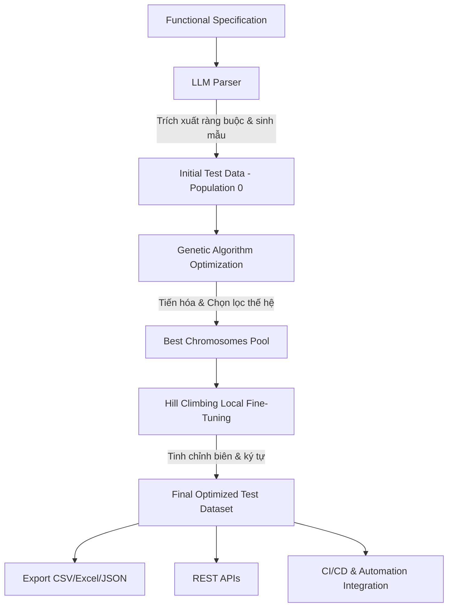
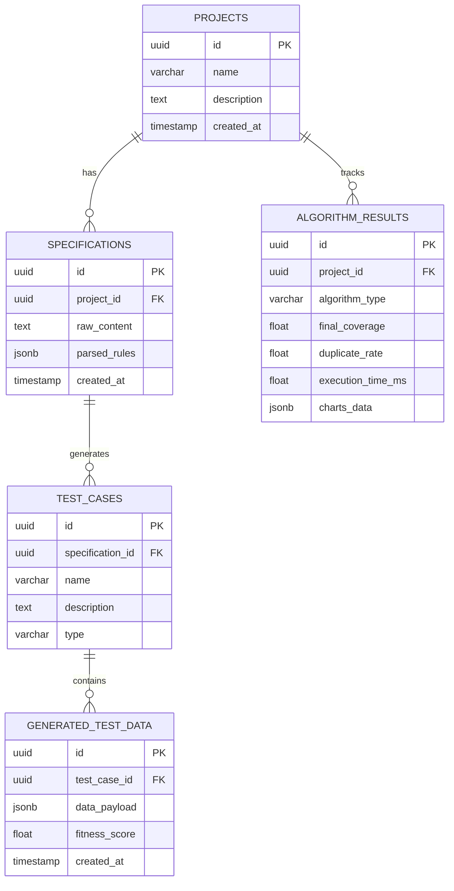

# BÁO CÁO PHÂN TÍCH ĐẶC TẢ YÊU CẦU PHẦN MỀM (SRS)
## Hệ Thống Sinh và Tối Ưu Hóa Dữ Liệu Kiểm Thử Thông Minh (LLM + GA + HC)

Tài liệu này cung cấp phân tích chuyên sâu về hệ thống **Intelligent Test Data Generation and Optimization Platform**, dựa trên tài liệu đặc tả [SRS_LLM_GA_HC_Testing_Platform_v1.docx](file:///d:/web_dev/llm_test_data/SRS_LLM_GA_HC_Testing_Platform_v1.docx).

---

## 1. Tổng Quan & Kiến Trúc Hybrid Đột Phá

Hệ thống đề xuất giải pháp kết hợp độc đáo giữa ba thành phần công nghệ chính để giải quyết bài toán sinh dữ liệu kiểm thử (Test Data):

1. **LLM (Large Language Model)**: Đóng vai trò **Semantic Parser** (Bộ phân tích ngữ nghĩa) và **Initial Generator** (Bộ sinh khởi tạo). LLM hiểu các đặc tả nghiệp vụ tự nhiên (Natural Language Specs), dịch chúng thành các ràng buộc (Constraints) mang tính logic và sinh ra thế hệ dữ liệu đầu tiên (Initial Population).
2. **Genetic Algorithm (GA - Thuật toán Di truyền)**: Đóng vai trò **Global Optimizer** (Tối ưu hóa toàn cục). Trực tiếp tiến hóa tập dữ liệu thông qua các phép chọn lọc (Selection), lai ghép (Crossover) và đột biến (Mutation) để tối đa hóa độ phủ (Coverage) và độ đa dạng, tránh trùng lặp.
3. **Hill Climbing (HC - Thuật toán Leo đồi)**: Đóng vai trò **Local Optimizer** (Tối ưu hóa cục bộ) để tinh chỉnh tinh vi (Fine-tuning) các trường dữ liệu ở mức độ ký tự/biên (e.g., điều chỉnh độ dài chuỗi, chèn ký tự đặc biệt, kiểm tra biên) nhằm phát hiện các ca kiểm thử biên đặc biệt (Edge Cases).

### Sơ Đồ Luồng Hoạt Động (Data & Process Flow)

---

## 2. Phân Tích Chi Tiết Các Yêu Cầu Chức Năng (FRs)

| Mã Yêu Cầu | Chức Năng | Phân Tích Kỹ Thuật & Luồng Xử Lý |
| :--- | :--- | :--- |
| **FR-01** | Nhập đặc tả chức năng | Giao diện cho phép nhập văn bản thô (e.g., "Username required, Password min 8 chars"). Hệ thống cũng cung cấp sẵn các **Preset Templates** để người dùng thử nghiệm nhanh (e.g., User Sign Up, Payment Gateway, API Endpoint). |
| **FR-02** | Sinh test data bằng LLM | Mô hình LLM phân tích các ràng buộc nghiệp vụ, tự động phân loại cấu trúc dữ liệu mong muốn (Schema) và sinh ra tập dữ liệu thô ban đầu (Population 0). |
| **FR-03** | Tối ưu bằng GA | Chạy vòng lặp di truyền qua nhiều thế hệ (Generations). Các tham số điều khiển bao gồm: Kích thước quần thể, Tỷ lệ lai ghép (Crossover Rate), Tỷ lệ đột biến (Mutation Rate). |
| **FR-04** | Fine-tuning bằng HC | Áp dụng leo đồi trên các cá thể tốt nhất. Thay đổi cục bộ (e.g., thêm ký tự đặc biệt, tăng giảm 1 đơn vị số, thay đổi chuỗi rỗng) để tìm kiếm các lỗ hổng bảo mật (SQL Injection, XSS) hoặc lỗi biên. |
| **FR-05** | Real-time Visualization | Biểu đồ hóa quá trình di truyền: Biểu đồ đường thể hiện **Độ thích nghi (Fitness)** qua từng thế hệ; các hiệu ứng trực quan khi xảy ra Crossover và Mutation; bảng dữ liệu cập nhật động. |
| **FR-06** | Phân tích độ phủ (Coverage) | Báo cáo chi tiết theo 3 trục: **Validation Coverage** (Độ phủ ràng buộc nghiệp vụ), **Boundary Coverage** (Độ phủ giá trị biên) và **Security Coverage** (Độ phủ các ca kiểm thử an toàn thông tin). |
| **FR-07** | Xuất dữ liệu | Chuyển đổi tập kết quả thành các định dạng CSV, Excel hoặc JSON để tích hợp trực tiếp vào các công cụ automation test (Selenium, Playwright, Postman). |
| **FR-08** | Tích hợp API | Cung cấp hệ thống REST API hoàn chỉnh phục vụ tích hợp CI/CD. Sandbox tương tác cho phép chạy thử API trực tiếp trên giao diện. |
| **FR-09** | Quản lý lịch sử | Lưu trữ các dự án cũ, lịch sử chạy thuật toán và kết quả tối ưu để dễ dàng so sánh hiệu năng qua các lần chạy. |

---

## 3. Thiết Kế Thuật Toán Tối Ưu (GA & HC)

Một phần cực kỳ quan trọng trong SRS là cơ chế di truyền và leo đồi. Dưới đây là phân tích chi tiết cách lập công thức và hiện thực hóa:

### 3.1. Thiết Kế Thuật Toán Di Truyền (GA)

*   **Chromosome (Nhiễm sắc thể)**: Đại diện cho một bản ghi dữ liệu kiểm thử (e.g., một bộ `(username, password, expected_result)`).
*   **Hàm Đánh Giá Độ Thích Nghi (Fitness Function)**:
    $$Fitness = w_1 \cdot ValidationScore + w_2 \cdot BoundaryScore + w_3 \cdot SecurityScore + w_4 \cdot DiversityScore - Penalty_{Duplicate}$$
    *   *ValidationScore*: Điểm số đạt được khi thỏa mãn các ràng buộc định dạng (e.g., định dạng Email hợp lệ).
    *   *BoundaryScore*: Điểm thưởng khi dữ liệu chạm đúng các ngưỡng biên (chuỗi siêu ngắn, chuỗi siêu dài, giá trị cực tiểu/cực đại).
    *   *SecurityScore*: Điểm thưởng khi phát hiện hoặc mô phỏng các chuỗi khai thác bảo mật (e.g., SQLi `' OR 1=1 --`, XSS `<script>`).
    *   *DiversityScore*: Mức độ khác biệt so với các cá thể khác trong quần thể.
    *   *Duplicate Penalty*: Điểm phạt nặng nếu cá thể bị trùng lặp hoàn toàn với cá thể đã tồn tại, thúc đẩy quần thể phát triển đa dạng.
*   **GA Operators (Phép toán GA)**:
    *   *Selection*: Chọn lọc tự nhiên (Roulette Wheel hoặc Tournament Selection) giữ lại các cá thể có Fitness cao nhất để làm cha mẹ.
    *   *Crossover (Lai ghép)*: Hoán vị các thuộc tính giữa cha và mẹ để tạo ra con (e.g., lấy `username` của cha ghép với `password` của mẹ).
    *   *Mutation (Đột biến)*: Thay đổi ngẫu nhiên một thuộc tính với tỷ lệ đột biến (e.g., biến đổi ngẫu nhiên một ký tự trong chuỗi mật khẩu thành ký tự đặc biệt).

### 3.2. Thiết Kế Thuật Toán Leo Đồi (HC)

Sau khi GA tìm được các cá thể tốt nhất toàn cục, Hill Climbing sẽ thực hiện tối ưu hóa cục bộ ở từng ký tự hoặc giá trị số:
*   **Neighborhood Generation (Sinh lân cận)**:
    *   Nếu trường dữ liệu là Số: Cộng/trừ 1 đơn vị, thử giá trị 0, cực đại, cực tiểu.
    *   Nếu trường dữ liệu là Chuỗi: Thêm 1 ký tự đặc biệt (`!`, `@`, `#`, `"`), xóa ký tự cuối, nhân đôi độ dài chuỗi.
*   **Quyết Định Leo Đồi**: Chấp nhận thay đổi lân cận nếu và chỉ nếu nó làm tăng **Boundary Coverage** hoặc **Security Coverage** (tức là tăng điểm Fitness cục bộ). Nếu không cải thiện, dừng thuật toán và giữ nguyên trạng thái tối ưu nhất.

---

## 4. Thiết Kế Cơ Sở Dữ Liệu & API

### 4.1. Cơ Sở Dữ Liệu (Quan hệ PostgreSQL gợi ý)

### 4.2. Thiết Kế API RESTful

*   `POST /api/specifications`: Nhận văn bản đặc tả nghiệp vụ thô, trả về kết quả phân tích cấu trúc ràng buộc (JSON Schema).
*   `POST /api/generate`: Sinh dữ liệu thô ban đầu (Population 0) thông qua tích hợp LLM.
*   `POST /api/optimize/ga`: Chạy thuật toán tối ưu hóa di truyền dựa trên các tham số cấu hình.
*   `POST /api/optimize/hc`: Kích hoạt tinh chỉnh leo đồi trên tập dữ liệu tối ưu nhất từ GA.
*   `GET /api/results`: Lấy danh sách kết quả, độ phủ và lịch sử tiến hóa.
*   `GET /api/export?format=csv|json|excel`: Xuất file dữ liệu kiểm thử.

---

## 5. Thách Thức Kỹ Thuật & Giải Pháp

1. **Hiệu năng & Thời gian phản hồi (NFR - Dưới 5 giây cho 100 records)**:
   * *Thách thức*: Việc gọi LLM API liên tiếp và chạy nhiều thế hệ di truyền (GA) có thể gây trễ (latency) lớn.
   * *Giải pháp*: Thiết kế bộ sinh ban đầu của LLM tinh gọn, tận dụng bộ nhớ cache cho các cấu trúc lặp lại. Đồng thời, chạy thuật toán GA + HC trực tiếp bằng Javascript bất đồng bộ (Web Workers hoặc Promises) trên Client để đảm bảo tốc độ phản hồi tính bằng mili-giây, không bị nghẽn bởi băng thông mạng.
2. **Tránh Bẫy Cực Tiểu Cục Bộ (Local Minima) trong Hill Climbing**:
   * *Thách thức*: Hill Climbing dễ bị kẹt ở các đỉnh tối ưu cục bộ và không thể tìm thấy các ca biên cực đoan hơn.
   * *Giải pháp*: Kết hợp chặt chẽ với GA đột biến cao ở các vòng cuối, hoặc sử dụng cơ chế **Random Restart Hill Climbing** (thử nghiệm các điểm xuất phát ngẫu nhiên khác nhau từ tập mẫu tốt của GA).
3. **Mối quan hệ loại trừ lẫn nhau giữa Độ Đa Dạng (Diversity) và Độ Thích Nghi (Fitness)**:
   * *Thách thức*: Nếu chỉ tập trung vào Fitness, thuật toán sẽ hội tụ rất nhanh về các bản ghi giống hệt nhau (e.g., tất cả đều là các chuỗi SQL Injection để đạt điểm bảo mật tối đa).
   * *Giải pháp*: Lập công thức phạt trùng lặp (Duplicate Penalty) tỷ lệ thuận với số lượng bản ghi tương đồng trong quần thể hiện tại, ép buộc thuật toán phải tìm kiếm các vùng không gian dữ liệu khác.

---

## 6. Đề Xuất Trực Quan Hóa Trên Giao Diện (Hi-Fi Prototype Simulator)

Để xây dựng một ứng dụng mang lại trải nghiệm tuyệt vời, chúng ta sẽ thiết kế một Dashboard giả lập tương tác cực kỳ sinh động:
*   **Chế độ Sáng/Tối (Deep Dark Mode)**: Sử dụng nền màu đen vũ trụ kết hợp hiệu ứng kính mờ (Glassmorphism), viền phát sáng neon (Teal cho GA, Violet cho HC).
*   **Đồ thị Tiến hóa Động (Real-time Fitness Graph)**: Sử dụng Chart.js vẽ đường đồ thị chạy real-time theo từng thế hệ (Generation) đang tiến hóa. Người dùng có thể nhấn nút "Pause", "Step-by-step", hoặc điều chỉnh thanh trượt tốc độ chạy (Speed Control).
*   **Live Mutation & Crossover Canvas/Grid**: Hiển thị danh sách các nhiễm sắc thể dưới dạng các khối lưới (Grid). Khi xảy ra Crossover, hai khối cha mẹ sẽ nháy sáng và hòa trộn màu sắc. Khi xảy ra Mutation, một ô thuộc tính sẽ phát sáng màu hồng neon để báo hiệu sự đột biến.
*   **So Sánh Thuật Toán (Interactive Comparison)**: Bảng so sánh 5 chế độ thuật toán (Random vs LLM vs GA vs HC vs GA+HC) được biểu diễn bằng biểu đồ cột động, làm nổi bật hiệu suất vượt trội của phương pháp Hybrid GA+HC về cả độ phủ biên lẫn tỉ lệ trùng lặp thấp.
