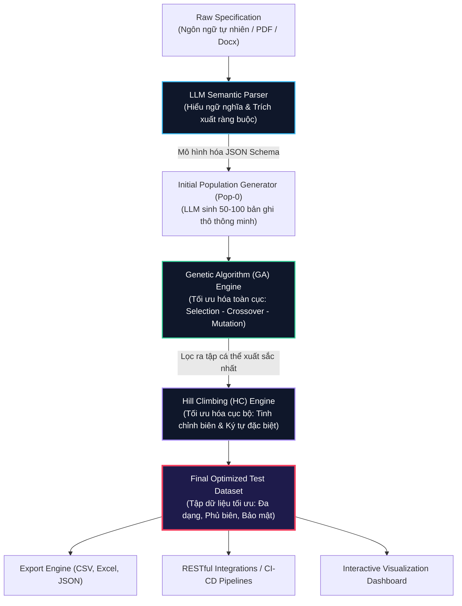
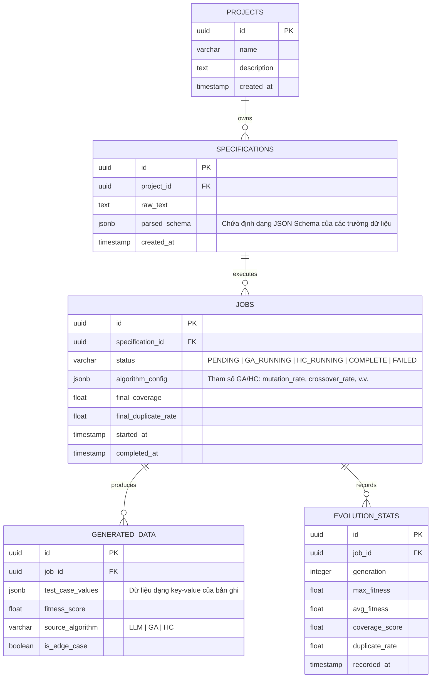

# BÁO CÁO PHÂN TÍCH HỆ THỐNG TOÀN DIỆN (SYSTEM ANALYSIS REPORT)
## Dự Án: Nền Tảng Sinh và Tối Ưu Hóa Dữ Liệu Kiểm Thử Thông Minh (LLM + GA + HC)
**Mã dự án**: `hyperion-testforge`  
**Chức danh người thực hiện**: Senior System Architect & Design Engineer  
**Trạng thái**: Bản đặc tả Phân tích Hệ thống Cao cấp (v1.0)

---

> [!NOTE]
> Báo cáo phân tích này được thiết kế để phục vụ hai mục tiêu song song: 
> 1. Đảm bảo tính khả thi về mặt kỹ thuật ở cấp độ **Production-Ready** (FastAPI, Redis, Celery, PostgreSQL, WebSockets).
> 2. Đạt chuẩn **High-Craft Portfolio** với trải nghiệm người dùng ấn tượng (Interactive Glassmorphic UI, Real-time Canvas Visualization, Live Algorithm Comparison).

---

## 1. TẦM NHÌN HỆ THỐNG & ĐỘT PHÁ CÔNG NGHỆ HYBRID

Các công cụ sinh dữ liệu kiểm thử hiện tại thường rơi vào các hạn chế sau:
*   **Dựa trên quy tắc (Rule-based)**: Quá cứng nhắc, đòi hỏi cấu hình thủ công phức tạp.
*   **LLM thuần túy**: Dù thông minh nhưng dễ gặp ảo giác (hallucination), không tối ưu được độ bao phủ (coverage) và chi phí API cực kỳ đắt đỏ nếu sinh hàng ngàn bản ghi.
*   **Thuật toán Di truyền (GA) thuần túy**: Tốt cho tối ưu hóa toàn cục nhưng thiếu khả năng hiểu ngôn ngữ tự nhiên để khởi tạo cấu trúc dữ liệu hợp lý ngay từ đầu.
*   **Leo đồi (Hill Climbing - HC) thuần túy**: Dễ bị mắc kẹt vào các cực trị cục bộ (local minima/maxima).

### Giải Pháp Hybrid Đột Phá: LLM + GA + HC
Hệ thống đề xuất một kiến trúc hybrid 3 lớp bổ trợ lẫn nhau một cách hoàn hảo:



1.  **LLM (Lớp Nhận thức & Khởi tạo - Semantic Layer)**: Đọc hiểu văn bản mô tả nghiệp vụ (ví dụ: *"Tên đăng nhập không được để trống, mật khẩu tối thiểu 8 ký tự, email đúng định dạng"*). LLM dịch chuyển thông tin này thành **JSON Schema** định nghĩa ràng buộc (Constraints Map) và tự động sinh ra **Thế hệ F0 (Initial Population)** gồm các bản ghi thô thông minh.
2.  **GA (Lớp Tiến hóa Toàn cục - Global Evolution Layer)**: Nhận thế hệ F0 và tiến hành quá trình chọn lọc tự nhiên qua hàng trăm thế hệ (Generations). GA thực hiện **Lai ghép (Crossover)** và **Đột biến (Mutation)** giữa các bản ghi dữ liệu (được coi là các Chromosome) để nâng cao điểm đánh giá (Fitness Score), tối đa hóa độ bao phủ và loại bỏ trùng lặp.
3.  **HC (Lớp Tinh chỉnh Cục bộ - Local Fine-Tuning Layer)**: Lấy các bản ghi tốt nhất từ GA và thực hiện các đột biến siêu vi (Micro-mutations) ở mức độ ký tự hoặc giá trị số để tìm kiếm các giá trị biên khắc nghiệt (Edge Cases) và các lỗ hổng bảo mật tiềm ẩn (như SQL Injection, XSS).

---

## 2. PHÂN TÍCH CHI TIẾT CÁC THÀNH PHẦN THUẬT TOÁN (ALGORITHM DESIGN)

### 2.1. Thiết Kế Thuật Toán Di Truyền (GA)

*   **Nhiễm Sắc Thể (Chromosome)**: Đại diện cho một bản ghi dữ liệu kiểm thử (e.g., một bộ `(username, password, email, expected_result)`). Mỗi thuộc tính là một **Gen**.
*   **Hàm Đánh Giá Độ Thích Nghi (Fitness Function)**: Đây là trái tim của GA. Nó chấm điểm từng bản ghi dựa trên nhiều tiêu chí:

$$\text{Fitness}(C) = w_v \cdot S_v(C) + w_b \cdot S_b(C) + w_s \cdot S_s(C) + w_d \cdot S_d(C) - P_{duplicate}(C)$$

Trong đó:
*   $S_v(C)$ (**Validation Score**): Điểm khớp cấu trúc. Bản ghi có định dạng đúng (ví dụ: email có `@`) sẽ được điểm cao.
*   $S_b(C)$ (**Boundary Score**): Điểm phủ biên. Bản ghi chứa giá trị chạm đúng ngưỡng giới hạn (ví dụ: chuỗi dài đúng 8 ký tự, hoặc số bằng 0) sẽ được cộng điểm thưởng.
*   $S_s(C)$ (**Security Score**): Điểm kiểm thử an toàn. Cộng điểm nếu dữ liệu giả lập các chuỗi tấn công phổ biến (SQLi: `' OR 1=1 --`, XSS: `<script>alert(1)</script>`).
*   $S_d(C)$ (**Diversity Score**): Điểm đa dạng. Đo lường khoảng cách Hamming/Levenshtein của cá thể $C$ so với các cá thể khác trong quần thể.
*   $P_{duplicate}(C)$ (**Duplicate Penalty**): Điểm phạt trùng lặp. Nếu cá thể $C$ giống hệt một cá thể khác, nó sẽ bị trừ điểm rất nặng để ngăn quần thể bị thoái hóa.
*   $w_v, w_b, w_s, w_d$: Các trọng số có thể cấu hình được bởi người dùng thông qua UI.

*   **Các Phép Toán Di Truyền**:
    *   **Selection (Chọn lọc)**: Sử dụng cơ chế **Tournament Selection** (quy mô = 3) hoặc **Roulette Wheel Selection** để giữ lại các cá thể xuất sắc nhất làm cha mẹ, đồng thời áp dụng chính sách **Elitism** (giữ nguyên 5% cá thể tốt nhất sang thế hệ sau không qua lai ghép).
    *   **Crossover (Lai ghép)**: Thực hiện **Uniform Crossover** ở cấp độ thuộc tính. Ví dụ: Con sẽ nhận `username` của Cha và `password`, `email` của Mẹ.
    *   **Mutation (Đột biến)**: Với tỷ lệ đột biến $p_m \approx 0.1$, thay đổi ngẫu nhiên giá trị của một thuộc tính dựa trên kiểu dữ liệu của nó (ví dụ: đổi chữ cái thường thành chữ hoa, hoặc thay đổi một số ngẫu nhiên).

### 2.2. Thiết Kế Thuật Toán Leo Đồi (Hill Climbing - HC)

Sau khi GA hoàn tất tiến trình tiến hóa toàn cục, hệ thống kích hoạt Hill Climbing trên top 5% cá thể xuất sắc nhất để tối ưu hóa cục bộ:

1.  **Hàm Sinh Lân Cận (Neighborhood Generation - $N(C)$)**:
    *   *Đối với Kiểu Số (Integer/Float)*: Tạo ra các lân cận bằng cách cộng/trừ $1$ đơn vị, cộng/trừ $0.01$ hoặc gán trực tiếp bằng các giá trị đặc biệt ($0$, $-1$, giá trị cực đại, giá trị cực tiểu).
    *   *Đối với Kiểu Chuỗi (String)*:
        *   Tăng độ dài chuỗi thêm 1 ký tự (ở đầu, giữa hoặc cuối).
        *   Giảm độ dài chuỗi đi 1 ký tự.
        *   Chèn các ký tự đặc biệt (`!`, `@`, `#`, `"`, `'`, `<`, `>`, `/`).
        *   Chuyển đổi chuỗi thành chuỗi rỗng (`""`) hoặc chuỗi chỉ gồm khoảng trắng.
2.  **Quyết Định Leo Đồi (Steepest Ascent)**:
    *   Tính toán $Fitness(C')$ cho tất cả các lân cận $C' \in N(C)$.
    *   Nếu tồn tại $C'$ sao cho $Fitness(C') > Fitness(C)$, ta di chuyển trạng thái sang $C$ ($C \leftarrow C'$).
    *   Nếu không có lân cận nào tốt hơn, ta kết thúc phiên leo đồi của cá thể đó. Điều này giúp tinh chỉnh dữ liệu đạt đến trạng thái "độc hại" nhất cho việc kiểm thử phần mềm (phát hiện lỗi biên sâu nhất).

---

## 3. THIẾT KẾ KIẾN TRÚC HỆ THỐNG MẪU (PRODUCTION ARCHITECTURE)

Hệ thống được thiết kế theo mô hình **decoupled backend-frontend** và phân tách các tác vụ tính toán nặng (CPU-intensive) thông qua hàng đợi tin nhắn (Message Queue).

### 3.1. Cơ Cấu Microservices & Containers

```
                     +---------------------------------------+
                     |         NEXT.JS CLIENT APP            |
                     +-------------------+-------------------+
                                         | (HTTPS / WebSockets)
                                         v
                     +---------------------------------------+
                     |         FASTAPI API GATEWAY           |
                     |  - API Routing & Authentication       |
                     |  - REST Endpoints (CRUD Projects/Specs)|
                     |  - WebSocket Manager                  |
                     +-------------------+-------------------+
                                         |
                       +-----------------+-----------------+
                       | (Enqueue Jobs)                    | (Pub/Sub)
                       v                                   v
             +-------------------+               +-------------------+
             |    REDIS BROKER   |               |    REDIS PUB/SUB  |
             +---------+---------+               +---------+---------+
                       |                                   ^
                       v (Worker Pool)                     | (Progress Event)
             +---------------------------------------------+---------+
             |            CELERY DISTRIBUTED WORKERS                 |
             |  - Worker 1: LLM Specification Parser & Initial Pop     |
             |  - Worker 2: Genetic Algorithm Optimizer Engine        |
             |  - Worker 3: Hill Climbing Local Fine-Tuner Engine    |
             +-------------------------------------------------------+
                                       |
                                       v (Read/Write)
                             +-------------------+
                             |  POSTGRESQL DB    |
                             +-------------------+
```

*   **Next.js Client**: Đảm nhận phần UI/UX cao cấp, tương tác thời gian thực thông qua WebSockets để cập nhật biểu đồ tiến hóa và lưới đột biến.
*   **FastAPI API Gateway**: Đóng vai trò tiếp nhận request của Client, xác thực người dùng, và tương tác trực tiếp với PostgreSQL. Khi người dùng bấm nút "Generate", FastAPI không tự chạy thuật toán mà đẩy tác vụ vào Redis Queue và trả ngay mã `202 Accepted` cùng `job_id` cho Client.
*   **Redis (Broker & Pub/Sub)**: Vừa làm hàng đợi cho Celery, vừa làm kênh Pub/Sub để truyền trực tiếp tiến trình tối ưu hóa (Fitness qua từng thế hệ) từ Celery Workers về FastAPI WebSocket để truyền trực tiếp đến trình duyệt của người dùng.
*   **Celery Workers**: Các tiến trình python độc lập chuyên xử lý tính toán. Phân chia làm 3 hàng đợi riêng biệt:
    1.  `high-priority`: Xử lý LLM Parsing (mất 2-3 giây).
    2.  `default`: Xử lý chạy thuật toán GA (mất 5-15 giây tùy số lượng thế hệ).
    3.  `bulk`: Xử lý Hill Climbing sâu hoặc các bài kiểm thử quy mô lớn (mất > 15 giây).

---

## 4. THIẾT KẾ CƠ SỞ DỮ LIỆU CHUYÊN SÂU (POSTGRESQL SCHEMA)

Hệ thống sử dụng cơ sở dữ liệu quan hệ PostgreSQL với các tính năng JSONB mạnh mẽ để quản lý linh hoạt các bộ schema động mà LLM trích xuất được.



### 3 Chỉ Mục Quan Trọng Tối Ưu Hóa Hiệu Năng
1.  **GIN Index trên cột `parsed_schema`** của bảng `specifications` để tìm kiếm và truy vấn các thuộc tính bên trong schema cực kỳ nhanh:
    ```sql
    CREATE INDEX idx_specs_parsed_schema ON specifications USING gin (parsed_schema);
    ```
2.  **Composite Index trên bảng `generated_data`** để tối ưu hóa việc xuất dữ liệu và hiển thị danh sách các ca kiểm thử có điểm Fitness cao nhất:
    ```sql
    CREATE INDEX idx_generated_data_job_fitness ON generated_data (job_id, fitness_score DESC);
    ```
3.  **Index trên `job_id` và `generation`** của bảng `evolution_stats` phục vụ việc vẽ đồ thị tiến trình thời gian thực:
    ```sql
    CREATE INDEX idx_eval_stats_job_gen ON evolution_stats (job_id, generation);
    ```

---

## 5. THIẾT KẾ RESTful APIs & WEBSOCKET PROTOCOLS

### 5.1. Các API Endpoint Chính

| Phương thức | Endpoint | Mô tả | Payload ví dụ / Response |
| :--- | :--- | :--- | :--- |
| **POST** | `/api/v1/projects` | Tạo dự án mới | `{"name": "E-Commerce Payment", "description": "..."}` |
| **POST** | `/api/v1/specifications` | Gửi văn bản đặc tả thô | `{"project_id": "uuid", "raw_text": "Email required..."}` |
| **POST** | `/api/v1/jobs` | Kích hoạt tiến trình sinh tối ưu | `{"specification_id": "uuid", "config": {"generations": 100, "pop_size": 200, "mutation_rate": 0.1}}` |
| **GET** | `/api/v1/jobs/{job_id}/results` | Lấy dữ liệu đã sinh tối ưu | Trả về danh sách các test cases đã tối ưu kèm điểm fitness |
| **GET** | `/api/v1/jobs/{job_id}/export` | Xuất tập dữ liệu ra file | Query params: `?format=csv\|excel\|json` |

### 5.2. WebSocket Realtime Protocol

Kết nối WebSocket được thiết lập qua endpoint: `/ws/jobs/{job_id}`

#### Giao thức bản tin tiến độ di truyền (GA Progress Frame):
```json
{
  "event": "GA_PROGRESS",
  "data": {
    "generation": 42,
    "max_fitness": 0.942,
    "avg_fitness": 0.785,
    "current_coverage": 0.88,
    "duplicate_rate": 0.02,
    "sample_chromosomes": [
      {
        "values": {"username": "admin123", "password": "superSecurePassword!", "email": "admin@domain.com"},
        "fitness": 0.942,
        "origin": "GA_MUTATION"
      }
    ]
  }
}
```

#### Giao thức bản tin tiến độ leo đồi (HC Progress Frame):
```json
{
  "event": "HC_PROGRESS",
  "data": {
    "status": "ACTIVE",
    "edge_cases_discovered": 14,
    "highest_fitness": 0.985,
    "mutated_field": "password",
    "current_tweak": "injecting SQLi payload: ' OR 1=1 --"
  }
}
```

---

## 6. THIẾT KẾ UI/UX CAO CẤP & CHIẾN LƯỢC TRỰC QUAN HÓA (WOW FACTOR)

Để dự án đạt cấp độ **Design-Engineer Portfolio**, giao diện ứng dụng không sử dụng các khuôn mẫu AI thông thường (AI Default) mà theo đuổi trường phái **Luxurious Cyberpunk Minimalism**:

### 6.1. Thiết Kế Trực Quan (Aesthetic Moodboard)
*   **Chủ đề màu sắc (Sleek Dark Mode)**: Sử dụng màu nền tối đen sâu thẳm (`#030712`) kết hợp các đường viền phát sáng siêu mỏng (1px). Các màu nhấn chức năng bao gồm:
    *   **Teal phát sáng (`#2dd4bf`)**: Đại diện cho các tác vụ di truyền (GA) mang tính sinh học tiến hóa.
    *   **Violet huyền bí (`#a78bfa`)**: Đại diện cho các bước leo đồi (HC) tinh tế.
    *   **Rose neon (`#f43f5e`)**: Báo hiệu khi xảy ra Đột biến (Mutation) hoặc phát hiện lỗ hổng bảo mật.
*   **Hiệu ứng mờ đục (Glassmorphism)**: Thẻ điều khiển sử dụng phông nền mờ kết hợp lớp lọc Backdrop Blur để tạo chiều sâu lớp không gian.

### 6.2. 3 Điểm Nhấn Trải Nghiệm Khách Hàng (Memorable Anchors)

#### 1. Đồ Thị Tiến Hóa Động Thời Giang Thực (Interactive Evolutionary Chart)
Sử dụng thư viện **Recharts** hoặc **Chart.js** vẽ biểu đồ tiến trình thời gian thực.
*   Trục X là **Generation** (Thế hệ), Trục Y là **Fitness score**.
*   Vẽ hai đường chạy song song: Đường **Max Fitness** (độ thích nghi cao nhất) màu Teal rực rỡ, đường **Average Fitness** màu Teal mờ nhạt hơn.
*   Khi thuật toán chuyển từ giai đoạn GA sang HC, đồ thị sẽ có một đường phân tuyến mờ màu Violet cùng hiệu ứng sóng phát sáng (ripple effect) chạy qua đồ thị để báo hiệu: *"Hill Climbing fine-tuning activated!"*.
*   Hệ thống cung cấp bộ điều khiển tốc độ giả lập: Tốc độ thường, Tốc độ cao, và Tạm dừng (Pause) để người dùng có thể soi kỹ từng nhiễm sắc thể đang tiến hóa.

#### 2. Lưới Nhiễm Sắc Thể Chạy Động (Live Chromosome Grid Canvas)
Thay vì các bảng dữ liệu tĩnh nhàm chán, ta biểu diễn quần thể 100 nhiễm sắc thể dưới dạng một lưới các chấm sáng hoặc các khối ô nhỏ (Grid):
*   Mỗi ô đại diện cho một nhiễm sắc thể. Độ sáng và màu sắc của ô tương ứng với điểm Fitness của nó (Càng gần 1.0 càng phát sáng Teal rực rỡ).
*   **Hiệu ứng Lai Ghép (Crossover)**: Khi hai cá thể cha mẹ được chọn để lai ghép, hai ô tương ứng trên màn hình sẽ nháy sáng nhẹ và bắn ra các hạt electron ảo (particle effect) kết hợp thành ô của cá thể con ở thế hệ mới.
*   **Hiệu ứng Đột Biến (Mutation)**: Khi một cá thể bị đột biến gen, ô đó sẽ lập tiếp chuyển sang màu hồng Rose rực rỡ trong 300ms rồi dịu lại. Điều này làm cho thuật toán tiến hóa "sống dậy" ngay trước mắt người xem.

#### 3. Bảng So Sánh Thuật Toán Động (Real-time Algorithm Battle Arena)
Cho phép người dùng chạy thử nghiệm so sánh trực quan giữa 5 phương pháp sinh dữ liệu:
1.  **Random**: Sinh ngẫu nhiên.
2.  **LLM Pure**: Sinh bằng mô hình ngôn ngữ lớn thuần túy.
3.  **GA Pure**: Sinh bằng thuật toán di truyền thuần túy.
4.  **HC Pure**: Sinh bằng thuật toán leo đồi thuần túy.
5.  **GA + HC (Hybrid)**: Sự kết hợp hoàn hảo.

Hệ thống biểu diễn kết quả thông qua 3 biểu đồ cột so sánh động:
*   **Độ phủ biên & bảo mật (Coverage Score %)** (GA+HC sẽ thắng tuyệt đối với >95%).
*   **Tỷ lệ trùng lặp dữ liệu (Duplicate Rate %)** (GA+HC sẽ thấp nhất nhờ Duplicate Penalty).
*   **Thời gian thực thi & Chi phí API (Cost/Performance %)** (GA+HC tối ưu nhờ chỉ gọi LLM một lần duy nhất lúc khởi tạo).

---

## 7. TIÊU CHUẨN AN TOÀN & BẢO MẬT (SECURITY ARMOR)

Dù hệ thống có khả năng sinh ra các payload nguy hiểm phục vụ cho việc kiểm thử bảo mật (SQL Injection, XSS), hệ thống vẫn phải tuân thủ nghiêm ngặt các quy tắc an toàn sau:

1.  **Ngăn Chặn Mã Độc Thực Thi (Sandbox Isolation)**:
    *   Tất cả dữ liệu kiểm thử được sinh ra đều được mã hóa và đối xử như **chuỗi văn bản thuần túy (Plain Text)**.
    *   Hệ thống tuyệt đối không thực hiện bất kỳ lệnh `eval()` hay chạy thử các câu lệnh SQL/Script sinh ra trên server.
2.  **Bảo Vệ Hệ Thống Trước Prompt Injection**:
    *   Khi người dùng nhập đặc tả thô, hệ thống thực hiện làm sạch dữ liệu đầu vào (Input Sanitization) để loại bỏ các ký tự điều khiển hệ thống.
    *   Sử dụng cơ chế **Structured Outputs** (Pydantic XML/JSON schemas kết hợp OpenAI API) để ép buộc LLM chỉ trả về cấu trúc JSON đúng chuẩn, vô hiệu hóa hoàn toàn các nỗ lực ra lệnh ẩn của người dùng.
3.  **Quản Lý Chi Phí API (Token Rate-Limiting)**:
    *   Mỗi tài khoản người dùng được giới hạn số lượng token LLM tối đa sử dụng trong ngày để ngăn chặn việc chạy lặp vô tận gây hao phí tài nguyên.
    *   Áp dụng bộ nhớ đệm Redis Cache cho các đặc tả trùng lặp để tránh gọi lại API LLM không cần thiết.

---

## 8. LỘ TRÌNH TRIỂN KHAI PHÁT TRIỂN (ROADMAP)

```
+---------------------------------------------------------------------------------+
| Giai đoạn 1: Thiết Lập Nền Móng & Thuật Toán Core (Tuần 1)                      |
| - Dịch chuyển cấu trúc PostgreSQL Schema, GIN index.                            |
| - Hiện thực hóa thuật toán GA và HC thuần bằng Python Core ở thư mục /workers.  |
| - Viết Unit Test đánh giá độ phủ và trùng lặp cho thuật toán.                   |
+---------------------------------------------------------------------------------+
                                       |
                                       v
+---------------------------------------------------------------------------------+
| Giai đoạn 2: Tích Hợp Hệ Thống Bất Đồng Bộ (Tuần 2)                             |
| - Xây dựng FastAPI API Gateway với endpoints REST.                              |
| - Thiết lập Redis Broker, Celery Task Orchestration bất đồng bộ.                |
| - Thiết lập Redis Pub/Sub và kênh truyền tin WebSocket thời gian thực.          |
+---------------------------------------------------------------------------------+
                                       |
                                       v
+---------------------------------------------------------------------------------+
| Giai đoạn 3: Hiện Thực UI/UX Cao Cấp & Trực Quan Hóa (Tuần 3)                    |
| - Phát triển Next.js Frontend với giao diện Glassmorphism Dark Mode.            |
| - Tích hợp Live Evolution Chart (Recharts) và Live Chromosome Grid (Canvas).    |
| - Hiện thực hóa bảng so sánh "Algorithm Battle Arena" chạy realtime sinh động.   |
+---------------------------------------------------------------------------------+
```
