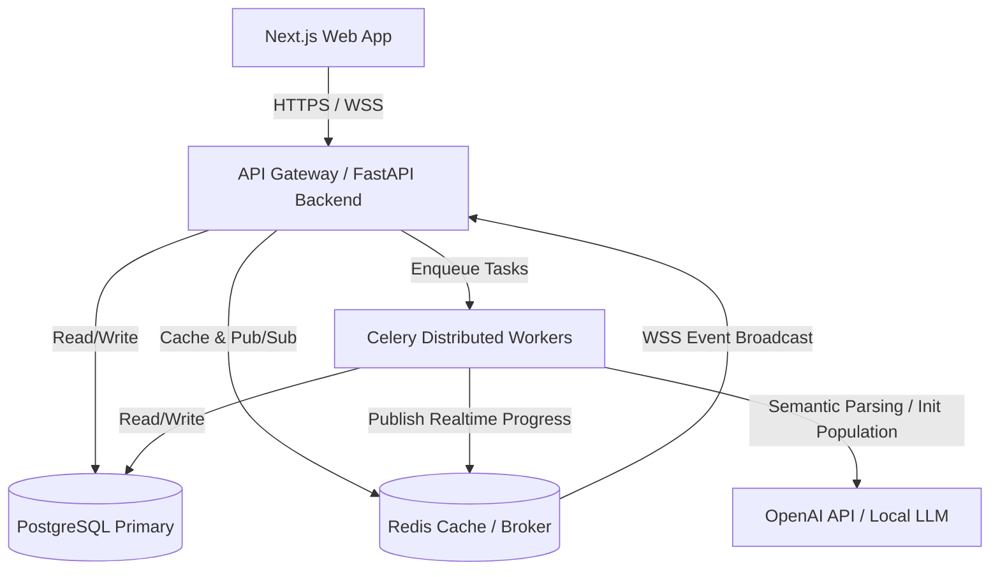
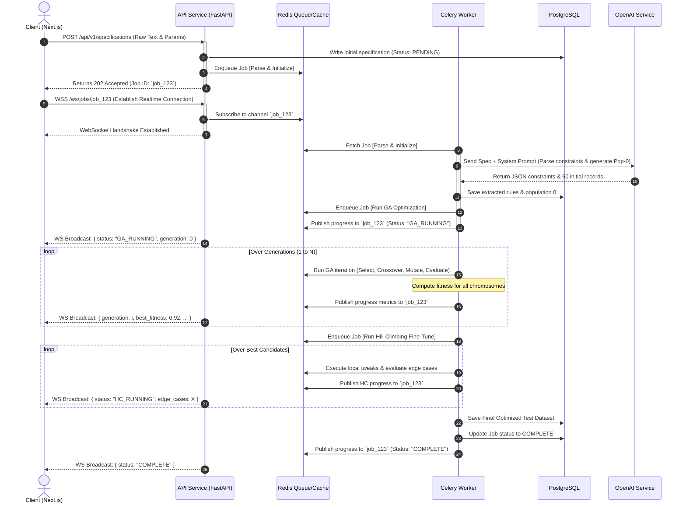
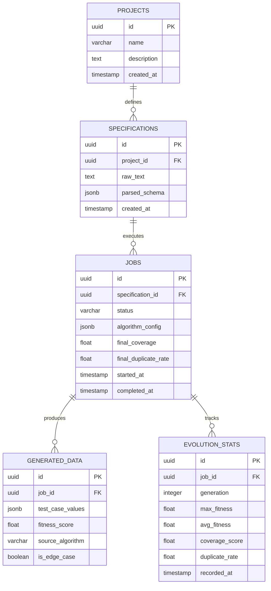

# PRODUCTION-READY SYSTEM ARCHITECTURE

## Intelligent Test Data Generation & Optimization Platform (LLM + GA + HC)

**Author**: Principal Software Architect  
**Status**: Architecture Design Blueprint (Draft v1.0)

---

## 1. High-Level Architecture (C4 System Context & Container)

The platform is designed around a **decoupled, event-driven, microservices-oriented architecture** to ensure horizontal scaling of high-compute tasks (Genetic Algorithms & Hill Climbing) while maintaining a highly responsive user experience.

### System Context Diagram



---

## 2. Microservices Breakdown

To enforce modularity and independent scaling, the backend is split into three primary logic groups, containerized separately:

```
                  +----------------------------------------------+
                  |               NEXT.JS FRONTEND               |
                  +----------------------+-----------------------+
                                         | (HTTP / WebSockets)
                                         v
                  +----------------------------------------------+
                  |             FASTAPI API SERVICE              |
                  |  - Auth & User Management                    |
                  |  - CRUD Specs & Projects                     |
                  |  - WebSocket Handlers & Redis PubSub listener|
                  +----------------------+-----------------------+
                                         | (Enqueue Task / DB State)
                                         v
                  +----------------------+-----------------------+
                  |             CELERY ORCHESTRATION             |
                  |  - Worker pool managing GA & HC jobs         |
                  +----------------------+-----------------------+
                     /                   |                  \
                    v                    v                   v
      +--------------------+   +--------------------+   +--------------------+
      |    AI CONNECTOR    |   |     GA ENGINE      |   |     HC ENGINE      |
      | (OpenAI API Parser)|   | (Global Evolution) |   | (Local Fine-Tuner) |
      +--------------------+   +--------------------+   +--------------------+
```

### 1. `api-service` (FastAPI)

- **Role**: Entrypoint for all client HTTP requests and WebSockets.
- **Responsibilities**: Authentication, input spec validation, CRUD operations on projects/specifications, enqueuing Celery tasks, and broadcasting realtime training metrics back to the client via WebSockets.
- **Scaling Strategy**: Stateless, scales horizontally behind a load balancer (e.g., Nginx, Traefik).

### 2. `ai-service / parser-module` (FastAPI/Internal)

- **Role**: Isolated boundary parser.
- **Responsibilities**: Manages prompts, formats prompt templates, connects to OpenAI API or a local LLM (e.g., Llama 3 on Ollama), parses specifications into JSON schemas and rules, and runs the initial zero-generation population synthesis.
- **Scaling Strategy**: Configured with circuit breakers to handle LLM rate limits and network latency.

### 3. `optimization-workers` (Celery + Python Core)

- **Role**: High-compute optimization engine.
- **Responsibilities**:
  - **GA Worker**: Executes the Genetic Algorithm loops. For each generation, it evaluates fitness, performs crossover, mutation, and publishes progress metrics (best chromosome, current average fitness, mutations count) to a Redis channel.
  - **HC Worker**: Executes Hill Climbing fine-tuning on the best chromosomes output by the GA engine to find edge cases.
- **Scaling Strategy**: Scales horizontally on GPU/CPU-optimized nodes. Uses isolated process pools for heavy numerical computation.

---

## 3. Folder Structure (Monorepo Layout)

A unified monorepo structure utilizing modern clean-architecture boundaries.

```
/hyperion-testforge
├── /docker
│   ├── api.Dockerfile
│   ├── worker.Dockerfile
│   ├── /nginx
│   │   └── nginx.conf
│   └── docker-compose.yml
├── /frontend                    # Next.js 15 App
│   ├── /src
│   │   ├── /app                # Next.js App Router (Pages & APIs)
│   │   ├── /components         # Premium Glassmorphic UI Components
│   │   │   ├── /dashboard      # Real-time GA Progress Cards
│   │   │   ├── /visualizer     # Live Crossover/Mutation Grid Canvas
│   │   │   └── /common         # UI elements (Buttons, Tables, Loaders)
│   │   ├── /hooks              # Real-time WebSocket hook, state hooks
│   │   ├── /lib                # HTTP clients, utilities
│   │   └── /types              # TypeScript type declarations
│   ├── tailwind.config.ts
│   └── package.json
├── /backend                     # FastAPI Root
│   ├── /app
│   │   ├── __init__.py
│   │   ├── main.py             # FastAPI entrypoint & middleware config
│   │   ├── /api                # API Routes (v1)
│   │   │   ├── auth.py
│   │   │   ├── projects.py
│   │   │   ├── specifications.py
│   │   │   └── websocket.py    # WebSocket routing and Redis pub/sub link
│   │   ├── /core               # Global configs, security, DB session
│   │   │   ├── config.py
│   │   │   ├── database.py
│   │   │   └── security.py
│   │   ├── /models             # SQLAlchemy/SQLModel models
│   │   │   ├── project.py
│   │   │   ├── specification.py
│   │   │   ├── job.py
│   │   │   └── test_data.py
│   │   ├── /schemas            # Pydantic schemas (DTOs)
│   │   └── /services           # Business logic layer
│   │       ├── ai_parser.py    # OpenAI prompt builder
│   │       └── job_manager.py  # Celery orchestrator
│   └── pyproject.toml
├── /workers                     # Celery Tasks & Computation Core
│   ├── /app
│   │   ├── __init__.py
│   │   ├── celery_app.py       # Celery configuration
│   │   ├── tasks.py            # Entrypoint tasks (run_ga, run_hc)
│   │   └── /algorithms         # Core GA + HC custom algorithms
│   │       ├── __init__.py
│   │       ├── chromosome.py   # Chromosome dynamic schemas
│   │       ├── fitness.py      # Multi-objective fitness function
│   │       ├── genetic_algo.py # GA Loop (Selection, Crossover, Mutation)
│   │       └── hill_climb.py   # Local Hill Climbing Neighborhood search
│   └── requirements.txt
├── /shared                      # DB migrations and shared schemas
└── README.md
```

---

## 4. Request Flow Diagram (Client to Worker)

The sequence below traces how a user specification text is converted into an optimized test dataset.



---

## 5. Queue System Architecture (Celery + Redis)

To handle massive parallel requests and long-running genetic evolutions without choking the primary API layer, the queue system is divided into **three priority queues**:

```
                         [ Redis Broker ]
                         /      |       \
                        v       v        v
                   [high]   [default]  [bulk]
                     |          |        |
                     v          v        v
                 +--------+ +--------+ +--------+
                 | Worker | | Worker | | Worker |
                 | (Short)| | (GA)   | | (HC)   |
                 +--------+ +--------+ +--------+
```

### Queue Definitions

1. **`high-priority`**:
   - **Jobs**: LLM parsing, short constraint evaluations, schema generation.
   - **Goal**: Fast round-trips for the user (response within 2-3 seconds).
2. **`default-priority`**:
   - **Jobs**: Standard Genetic Algorithm runs (up to 100 generations, 100-500 population size).
3. **`bulk-priority`**:
   - **Jobs**: Complex GA runs (> 500 generations) and deep Hill Climbing fine-tuning runs (which require substantial computation of boundary variations).

### Fault Tolerance & Retry Strategy

- **LLM Failures**: If OpenAI API throws a `RateLimitError` or `APITimeoutError`, Celery uses an exponential backoff retry:
  ```python
  @app.task(bind=True, max_retries=3, default_retry_delay=5)
  def parse_specification(self, spec_id):
      try:
          # LLM API Call...
      except RateLimitError as exc:
          raise self.retry(exc=exc, countdown=2 ** self.request.retries)
  ```
- **Dead Letter Queue (DLQ)**: Failed tasks that exceed their maximum retry count are redirected to the `failed-jobs` queue for developer visibility and debugging.
- **Task State Tracking**: Task states are saved in Redis backends (`PENDING`, `STARTED`, `PROGRESS`, `SUCCESS`, `FAILURE`) for instant querying by the FastAPI endpoint.

---

## 6. Database Architecture & PostgreSQL Schema

A relational layout designed to map projects, specs, evolutionary metadata, and generated datasets.

### Entity Relationship Diagram (ERD)



### Strategic Indexes for Performance

1. **JSONB Indexing**: To allow extremely fast searching inside parsed validation schemas:
   ```sql
   CREATE INDEX idx_specs_parsed_schema ON specifications USING gin (parsed_schema);
   ```
2. **Composite Index for Test Cases**: To optimize exporting of data filterable by fitness score and algorithm type:
   ```sql
   CREATE INDEX idx_generated_data_job_fitness ON generated_data (job_id, fitness_score DESC);
   ```

---

## 7. Realtime Architecture (WebSockets + Redis Pub/Sub)

For high-craft, real-time UI/UX visual updates during evolutionary stages, the platform uses **FastAPI WebSockets integrated with a Redis Pub/Sub layer**.

```
  +--------------+               +---------------------+               +--------------+
  | Celery Task  | --(Publish)-->|  Redis Pub/Sub      | --(Broadcast)-->| API WebSockets|
  | (Evolving)   |               | Channel: `job_123`  |               | (FastAPI)    |
  +--------------+               +---------------------+               +--------------+
                                                                              |
                                                                          (WSS Frame)
                                                                              v
                                                                       +--------------+
                                                                       | Next.js App  |
                                                                       | (Dynamic UI) |
                                                                       +--------------+
```

### 1. The Worker Publisher

During GA loops (inside the Celery process), every N generations, the worker publishes metrics straight to a dedicated channel:

```python
# Inside workers/app/algorithms/genetic_algo.py
import json
import redis

r = redis.Redis(host='redis', port=6379, db=0)

def publish_generation_progress(job_id, generation, population, stats):
    payload = {
        "event": "PROGRESS",
        "generation": generation,
        "best_fitness": stats["best_fitness"],
        "avg_fitness": stats["avg_fitness"],
        "coverage": stats["coverage"],
        "duplicate_rate": stats["duplicate_rate"],
        "chromosomes": [c.to_dict() for c in population[:10]] # Top 10 for visualization
    }
    r.publish(f"job:{job_id}", json.dumps(payload))
```

### 2. The FastAPI WebSocket Bridge

The API acts as a gateway subscribing to Redis and piping the frames directly to client-facing sockets:

```python
# Inside backend/app/api/websocket.py
from fastapi import APIRouter, WebSocket, WebSocketDisconnect
import asyncio
import aioredis

router = APIRouter()

@router.websocket("/ws/jobs/{job_id}")
async def websocket_job_stream(websocket: WebSocket, job_id: str):
    await websocket.accept()
    redis_conn = await aioredis.from_url("redis://redis:6379/0")
    pubsub = redis_conn.pubsub()
    await pubsub.subscribe(f"job:{job_id}")

    try:
        while True:
            # Non-blocking check for new messages in Pub/Sub
            message = await pubsub.get_message(ignore_subscribe_messages=True)
            if message:
                data = message['data'].decode('utf-8')
                await websocket.send_text(data)
            await asyncio.sleep(0.05) # Prevent CPU spinning
    except WebSocketDisconnect:
        await pubsub.unsubscribe(f"job:{job_id}")
```

---

## 8. Security Architecture

Given the sensitive nature of business requirements, mock data, and LLM integrations, five key security parameters are established:

### 1. LLM Prompt Isolation & Input Sanitization

- **The Threat**: User injects malicious guidelines to hijack the OpenAI system prompt.
- **The Mitigation**:
  - Strict system instruction boundaries in the prompt configuration.
  - Enforcement of output JSON structures (OpenAI **JSON Mode** / **Structured Outputs** with Pydantic parsing).
  - Sanitizing inputs using regex patterns to strip active terminal characters.

### 2. API Security Hardening (JWT & OAuth2)

- Standardized authorization using stateless JSON Web Tokens (JWT) signed using HMAC-SHA256.
- All communications (HTTP and WebSockets) are encrypted in-transit via TLS/HTTPS/WSS.

### 3. Rate-Limiting & Cost Protection

- **IP-based Rate Limiting**: Managed by Nginx / FastAPI slow-api using Redis sliding window counters to limit spec submissions.
- **Token Budgeting**: Daily limits on token consumption per user/project to prevent runaway LLM costs.

### 4. Sandbox Isolation (Safe Code Generation)

- Although the platform outputs SQL Injection payloads and XSS vulnerability test cases, they are **treated strictly as text data**.
- **NO** active server-side execution of generated values is permitted.

### 5. Encrypted Database Storage

- Specs, projects, and generated test files are encrypted at rest using AES-256 within the cloud storage boundary to ensure business confidentiality.
